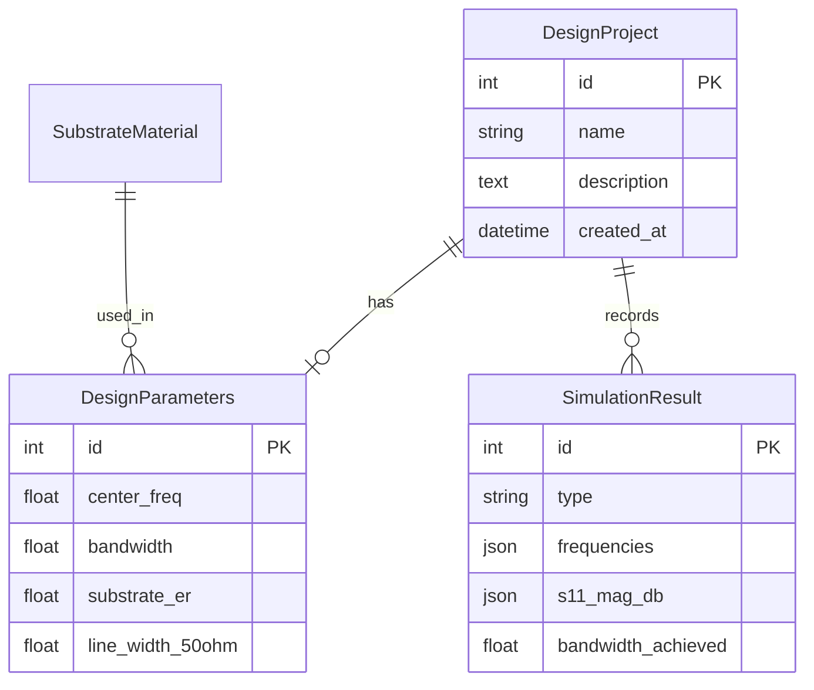

# 📡 Wideband Branchline Balun Designer

A professional RF design and simulation tool for Wideband Branchline Baluns. This application provides a comprehensive environment for designing, simulating, and optimizing multiband/wideband baluns with an emphasis on microstrip implementation.


## 🚀 Key Features

- **📐 Design Calculator**: Interactive calculator for microstrip dimensions based on substrate properties and design frequency.
- **📊 Simulation Mode**: High-fidelity simulation of S-parameters ($S_{11}$, $S_{21}$, $S_{31}$) and Phase Balance using frequency-dependent models.
- **🎲 Yield Analysis**: Statistical Monte Carlo analysis to evaluate manufacturing tolerances and design robustness.
- **⚖️ Comparison Tool**: Benchmark different design stages (Conventional, Wideband, Ultra-Wide) against each other.
- **📋 Automated Reporting**: Generate professional PDF reports of your design and simulation results.
- **💾 CAD Export**: Export designs to GDSII and DXF formats for manufacturing (L-Edit, AutoCAD compatible).

## 📐 Substrate Specification: FR4 Standard

This project is optimized for the **FR4 Standard** substrate, widely used for low-cost prototyping and consumer-grade RF applications:

- **Relative Permittivity ($\epsilon_r$):** 4.4
- **Substrate Thickness ($h$):** 1.6 mm
- **Loss Tangent ($\tan \delta$):** 0.02
- **Copper Thickness ($t$):** 35 $\mu$m (1 oz/ft²)

> [!NOTE]
> While FR4 is cost-effective, its high loss tangent ($\tan \delta = 0.02$) can impact insertion loss at frequencies above 3 GHz. The simulation engine accounts for these losses to provide realistic $S_{21}$ and $S_{31}$ predictions.

## 🧠 Mathematical Foundation

The application implements industry-standard equations for microstrip synthesis and analysis:

### 1. Microstrip Synthesis (Wheeler's Equations)
To find the width $W$ for a target impedance $Z_0$ on a substrate with height $h$ and relative permittivity $\epsilon_r$:
- **Narrow Strip ($W/h \le 2$):**
  $$A = \frac{Z_0}{60} \sqrt{\frac{\epsilon_r + 1}{2}} + \frac{\epsilon_r - 1}{\epsilon_r + 1} \left(0.23 + \frac{0.11}{\epsilon_r}\right)$$
  $$\frac{W}{h} = \frac{8 e^A}{e^{2A} - 2}$$
- **Wide Strip ($W/h > 2$):**
  $$B = \frac{377 \pi}{2 Z_0 \sqrt{\epsilon_r}}$$
  $$\frac{W}{h} = \frac{2}{\pi} \left[ B - 1 - \ln(2B - 1) + \frac{\epsilon_r - 1}{2\epsilon_r} \left( \ln(B-1) + 0.39 - \frac{0.61}{\epsilon_r} \right) \right]$$

### 2. Effective Permittivity (Hammerstad-Jensen)
Calculates $\epsilon_{eff}$ considering the fringing fields:
$$\epsilon_{eff} = \frac{\epsilon_r + 1}{2} + \frac{\epsilon_r - 1}{2} \left[ 1 + 12\frac{h}{W} \right]^{-0.5}$$

### 3. Dispersion Model (Kirschning-Jansen)
For high-frequency accuracy, the tool accounts for frequency-dependent $\epsilon_{eff}(f)$ and $Z_0(f)$ using the Kirschning-Jansen model, ensuring results remain valid up to X-band.

## 📈 Simulation Methodology

The simulator uses the **ABCD (Transmission) Matrix** method to analyze the cascaded network of transmission lines:

1.  **Transmission Line Section**:
    $$\begin{bmatrix} A & B \\ C & D \end{bmatrix} = \begin{bmatrix} \cos(\beta \ell) & j Z_0 \sin(\beta \ell) \\ j Y_0 \sin(\beta \ell) & \cos(\beta \ell) \end{bmatrix}$$
    Where $\beta$ is the phase constant and $\ell$ is the physical length.
2.  **Loss Integration**: Includes both conductor (Skin effect) and dielectric (Loss tangent) losses per unit length.
3.  **Monte Carlo Yield**: Randomly perturbs $\epsilon_r (\pm 5\%)$ and $h (\pm 5\%)$ over $N$ runs to determine the probability of meeting Return Loss $> 10\text{dB}$ and Phase Balance $\pm 5^\circ$ specs.

## 🗄️ Database Architecture

The application uses SQLAlchemy with a SQLite backend to persist design projects and simulation results.



## 🛠️ Technology Stack

- **Frontend**: [Streamlit](https://streamlit.io/)
- **Core RF**: [NumPy](https://numpy.org/), [SciPy](https://scipy.org/)
- **Visualization**: [Plotly](https://plotly.com/), Matplotlib
- **Database**: [SQLAlchemy](https://www.sqlalchemy.org/)
- **CAD Support**: `gdspy`, `ezdxf`

## 📂 Project Structure

```text
.
├── app.py              # Main GUI implementation & Layout
├── run.py              # Application runner
├── core/               # Engineering Logic
│   ├── microstrip.py   # Wheeler & Hammerstad implementations
│   ├── rf_calculations.py # Physical constants & core equations
│   ├── simulation.py   # ABCD Matrix engine & Monte Carlo
│   └── layout_generator.py # CAD geometry kernels
├── database/           # Persistence Layer
│   └── models.py       # SQLAlchemy Schema
├── components/         # Reusable Streamlit UI fragments
└── Dockerfile          # Multi-stage production build
```

## ⚙️ Quick Start

### Local Setup
```bash
pip install -r requirements.txt
python run.py
```

### Advanced: Using the Library Directly
You can use the RF engines without the GUI:
```python
from core.microstrip import MicrostripCalculator
from core.rf_calculations import SubstrateProperties

sub = SubstrateProperties(epsilon_r=4.4, thickness_mm=1.6, loss_tangent=0.02)
calc = MicrostripCalculator(sub)
width = calc.width_for_impedance(50.0)
print(f"50 Ohm Width: {width:.3f} mm")
```

## 📄 License
MIT License
